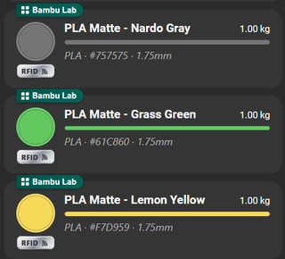
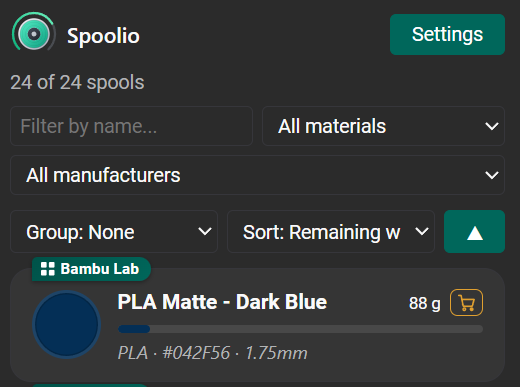
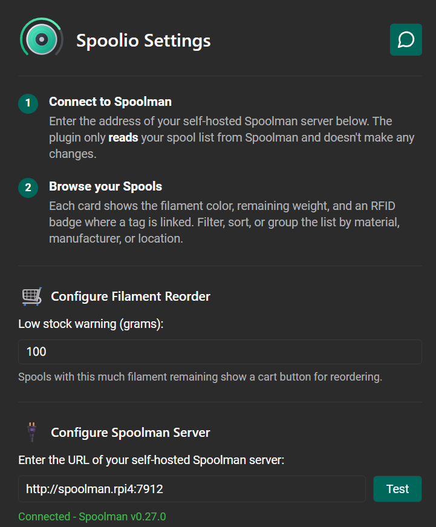

  

# Spoolio for OrcaSlicer

Spoolio _(Spool Inventory Overview)_ is a Bambu Lab inspired filament inventory plugin for OrcaSlicer, powered by your self-hosted [Spoolman](https://github.com/Donkie/Spoolman) server. It only ***reads*** from Spoolman and doesn't make any changes.

> [!IMPORTANT]
> Spoolio ***<ins>is not</ins>*** a filament profile manager (nozzle temps, flow ratios, pressure advance etc) those settings are configured in your filament profiles within OrcaSlicer.  If you're looking for a tool that covers this then I would recommend [PipSpool](https://github.com/Gadonk/pipspool-orcaslicer) or [FilamentHub](https://github.com/WeLizard/FilamentHub). 

This plugin is best used in parallel with [BambuLab AMS Spoolman Status](https://github.com/Rdiger-36/bambulab-ams-spoolman-filamentstatus) which tracks your filament usage and automatically updates Spoolman.  

## Key Features
- **Spool cards:** Showing colour, vendor, remaining weight, a progress bar in the spool's own colour and material / colour hex / diameter details.
- **RFID badge:** On spools that have a tag linked in Spoolman (requires Spoolman v.0.27.0 or newer).
- **Filter, sort and group:** By material, manufacturer or location.
- **Low-stock reorder button:** Spools under the user defined threshold will generate a cart icon on the card that opens a web search for reordering (either by a user input Spoolman article no. or it defaults to the filament name)
- **Guided settings:** With a connection test before your Spoolman address can be saved.
- Matches OrcaSlicer's **light and dark theming**.
- Works on **Windows, macOS and Linux** (x86_64 and arm64) with a single file.

## Images

  
  
  

## Requirements

- A current OrcaSlicer **nightly build** (tested on build dev.2.5.0 [93b58a20] and confirmed as working).
- A self-hosted Spoolman server (v0.27.0 or newer required to show RFID tags).

## Install

**From Orca Cloud:** subscribe to Spoolio in the Plugin Hub, then in
OrcaSlicer open ***File > Plugins***, click ***Refresh*** and tick ***Activate***.

**Manually:** download `spoolio_any.py` from the [latest release](../../releases/latest) and place it in
its own folder called `spoolio` inside OrcaSlicer's plugin directory:

| OS | Plugin directory |
|---|---|
| Windows | `%APPDATA%\Roaming\OrcaSlicer\orca_plugins\` |
| macOS | `~/Library/Application Support/OrcaSlicer/orca_plugins/` |
| Linux | `~/.config/OrcaSlicer/orca_plugins/` |

Restart OrcaSlicer, then tick ***Activate*** for Spoolio.

## Set Up

The Settings & About page opens on first run. Enter your Spoolman server address (for example `http://raspberrypi.local:7912`), 
click ***Test***, once the connection is confirmed then ***Save & Close***. You can also set the low-stock threshold here, and 
reopen the page any time with the ***Settings*** button.

OrcaSlicer asks before a plugin does anything sensitive. Expect a prompt the first time the plugin connects to Spoolman, 
and another the first time you click a reorder cart to open your browser.

## Feedback and Contributing

Encounter a problem or have an idea? Please
[report a bug](../../issues/new?template=bug_report.yml) or
[request a new feature](../../issues/new?template=feature_request.yml).

Pull requests are welcome - see [CONTRIBUTING.md](CONTRIBUTING.md).

## Acknowledgements

- [**Spoolman**](https://github.com/Donkie/Spoolman) by Donkie and contributors,
  the filament inventory server this plugin reads from.
- [**OrcaSlicer**](https://github.com/OrcaSlicer/OrcaSlicer) by SoftFever and
  contributors, for the Python plugin system this is built on.
- The **Bambu Handy** app, whose spool cards inspired the design.

This is an independent community project, not affiliated with or endorsed by
Spoolman, OrcaSlicer or Bambu Lab.

## License

GNU General Public License v3.0 - see [LICENSE](LICENSE).
